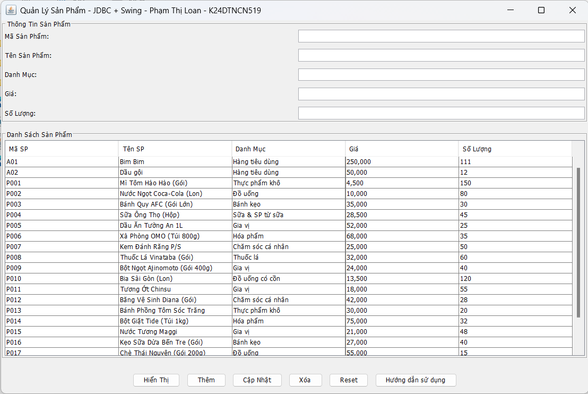

## 🚀 CÁCH CHẠY PROJECT
Yêu Cầu và Khởi Động
1. Môi trường: Máy tính hỗ trợ chạy Java Runtime Environment (JRE)
2. Khởi động: Click đúp vào file K24DTCN519-LoanPT-product-manage-1.0.jar
3. Giao diện: Ứng dụng sẽ hiển thị Menu Quản Lý Sản Phẩm với Form nhập liệu và Bảng dữ liệu (JTable)

## Cấu trúc database 
 TABLE products
(
    product_id TEXT PRIMARY KEY,
    name       TEXT    NOT NULL,
    category   TEXT,
    price      REAL    NOT NULL,
    quantity   INTEGER NOT NULL,
    CHECK (price > 0),
    CHECK (quantity >= 0)
);

## 📝 HƯỚNG DẪN SỬ DỤNG CHỨC NĂNG

### **1. NÚT "HIỂN THỊ"**
- **Chức năng**: Tải lại toàn bộ danh sách sản phẩm từ database lên JTable
- **Cách dùng**: Nhấn nút → Dữ liệu sẽ được refresh
- **Khi nào dùng**: Khi muốn xem danh sách mới nhất sau khi thêm/sửa/xóa

### **2. NÚT "THÊM"**
- **Chức năng**: Thêm sản phẩm mới vào database
- **Các bước**:
  1. Nhập đầy đủ thông tin vào 5 ô (Mã SP, Tên, Danh mục, Giá, Số lượng)
  2. Nhấn nút **Thêm**
  3. Hệ thống sẽ kiểm tra:
     - Mã SP không trống
     - Tên không trống
     - Giá > 0
     - Số lượng >= 0
     - Mã SP chưa tồn tại
  4. Nếu hợp lệ → Thêm thành công → Table tự động cập nhật

### **3. NÚT "CẬP NHẬT"**
- **Chức năng**: Sửa thông tin sản phẩm đã có
- **Các bước**:
  1. **Click chọn 1 hàng trong JTable** → Thông tin tự động hiển thị lên form
  2. Chỉnh sửa thông tin (có thể sửa Tên, Danh mục, Giá, Số lượng)
  3. Nhấn nút **Cập Nhật**
  4. Hệ thống validate → Nếu hợp lệ → Cập nhật thành công

**LƯU Ý**: Không thể sửa **Mã Sản Phẩm** (PRIMARY KEY)

### **4. NÚT "XÓA"**
- **Chức năng**: Xóa sản phẩm khỏi database
- **Các bước**:
  1. **Click chọn 1 hàng trong JTable**
  2. Nhấn nút **Xóa**
  3. Hộp thoại xác nhận xuất hiện → Nhấn **Yes** để xóa, **No** để hủy
  4. Nếu xóa thành công → Table tự động cập nhật

### **5. NÚT "RESET"**
- **Chức năng**: Xóa toàn bộ dữ liệu trên form (không ảnh hưởng database)
- **Cách dùng**: Nhấn nút → Tất cả ô nhập liệu sẽ trống
- **Khi nào dùng**: Khi muốn nhập sản phẩm mới hoặc hủy thao tác hiện tại

### **6. NÚT "Hướng dẫn sử dụng"**
- **Chức năng**: Hiển thị các lưu ý khi sử dụng phầm mềm
- **Cách dùng**: Nhấn nút → Các lưu ý Thêm, Cập Nhật, Xóa sẽ được gợi ý
- **Khi nào dùng**: Khi muốn thao tác trên phần mềm